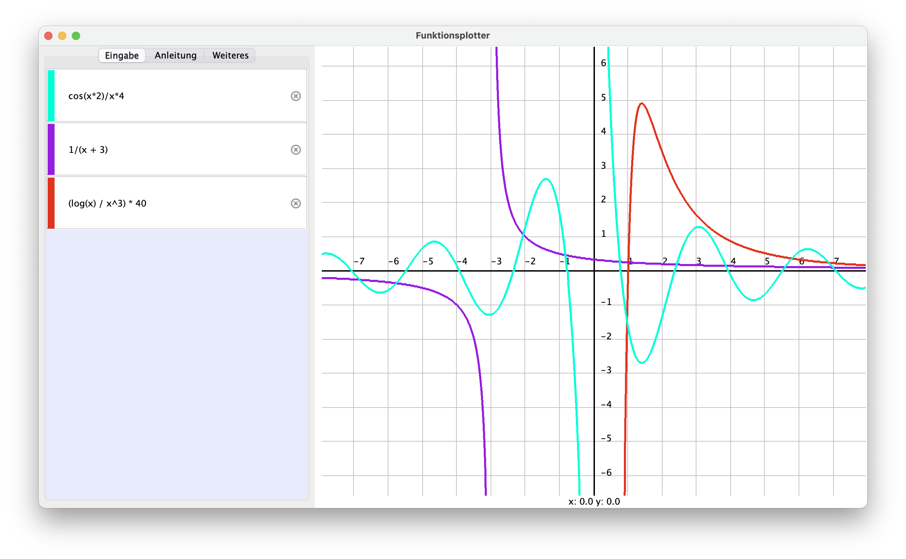

# ParserPlotter

Joint programming assignment SS/2022 HTWK Leipzig.

Program that can parse mathematical expressions with operators `*`, `+`, `/`, `^`, `-` and functions `cos()`, `sin()`, `tan()`, `log()`, `sqrt()`, `abs()` and plot their graphs in the x/y plane.

## Contributors
- [bubba2k](https://github.com/bubba2k): [Parser](./src/parser/)
- [99cardz](https://github.com/99cardz): [Canvas](./src/canvas/)
- [nessel2nert](https://github.com/nessel2nert): [GUI](./src/gui/)

## Notes

### GUI

The view port of the plane can be scaled around the origin or the mouse pointer and moved by dragging across the canvas.
The canvas supports the plotting of up to eight expressions. Add a new input field by pressing Return inside another input field. Each graph is assigned a random color that matches the expression input's colored line. This color can be customized by clicking on the line. The graph is updated immediately to preview the changes.

#### Discontinuous functions

During plotting each horizontal pixel on the canvas and its corresponding x-value is mapped to a y-value and therefore a point on the canvas. Neighboring points are connected with a line. However, this approach breaks whenever the function is discontinuous or passes a pole. When the y-value approaches positive or negative infinity, points should not be connected with a line. Because checking for limits of the function requires calculating the derivative of the function, which would have left scope of the assignment, we chose a simpler approach. 

Instead of evaluating each x-value individually we evaluate them in bulk by storing them in an array. That array is evaluated using the syntax tree provided by the parser. By having access to not only the current value but the previous one as well, we can more easily determine when a pole is passed. For example, when the divisor in a division becomes 0, we can assume that the function between these points passes a pole. The computed y-values at these points will then get 'corrected' to their respective limits and accounted for during drawing.

Examples for where the problem occurred are `1/x` or `tan(x)`.

#### Parser

Mogensen, T. (2010). _Basics Of Compiler Design_  
Aho, A. V., Lam, M. S., Sethi, R., Ullman, J. D. (2007). _Compilers - Principles, Techniques, & Tools (Second Edition)_

_Recursive Descent Parsing_ by hhp3 - https://youtu.be/SToUyjAsaFk  
Java Docs - https://docs.oracle.com/en/java/  
_Regular Expressions in Java_ by Lars Vogel https://www.vogella.com/tutorials/JavaRegularExpressions/article.html  

Other bits:  
https://stackoverflow.com/questions/8938498/get-the-index-of-a-pattern-in-a-string-using-regex  
